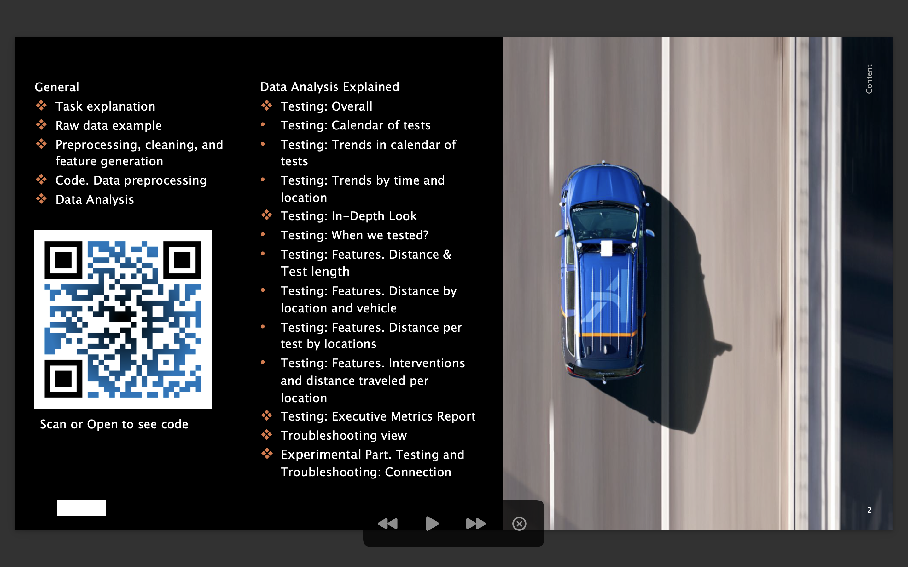

## 🛻 Project
**🚙 CAV (AV) testing operations, data case**.

<table align="left">
  <thead>
    <tr>
      <th></th>
      <th></th>
    </tr>
  </thead>
</table>

## 📖 Task description
We have a **pool of questions** and **two dataset provided** to use to find answers and present interesting observations.

* Datasets contain anonymized & artificially generated observations on AV testing across different location and inventory
  * No extra documentation (inc. meaning, data types, expected values for columns) were provided

Current **raw report available**, see [[html]](https://htmlpreview.github.io/?https://github.com/Witold1/CAV_data_case/blob/master/reports/Report_final.html) | [[ipynb]](https://nbviewer.org/github/Witold1/CAV_data_case/blob/master/notebooks/Report_final.ipynb)

**Presentation deck available**, see [[pdf]](https://drive.google.com/file/d/1KPciOPsQ1hpW3ij8KY1EatRXYsiUZNRv/view?usp=sharing)

## 📊 Selected charts
<details>
  <summary>Charts & Slides - click to expand</summary>
  <table align="center">
    <thead>
      <tr>
        <th></th>
      </tr>
      <tr>
        <th></th>
      </tr>
      <tr>
        <th></th>
      </tr>
    </thead>
  </table>
</details>

## 📁 Structure of repository
```
Project structure:
+--data                       <- folder for datasets
¦  L--raw                       <- ... 1. raw data
¦  L--interim                   <- ... 2. auxiliary, generated, temporary, preprocessed data
¦  L--processed                 <- ... 3. final, ready-to-analysis data
¦  L--external                  <- ... +. additional datasets
¦  
+--notebooks                  <- folder for *.ipynb files
¦  L--*.ipynb 1                 <- ... file 1
¦
+--src                        <- folder for .py scripts
¦  L--*.py 1                    <- ... file 1
¦  L--*.py 2                    <- ... file 2
¦  L--*.py 3                    <- ... file 3
¦
+--figures                    <- folder for charts and images to reports
¦  L--external                  <- ... 1. external images
¦  L--internal                  <- ... 2. internal images
¦
+--reports                    <- folder for reports (i.e. *.pptx, *.html, *.ipynb)
¦
+--docs                       <- folder for documentation files
¦
+--README.md                  <- the top-level README for developers using this project
```
[Cookiecutter Data Science](https://drivendata.github.io/cookiecutter-data-science/#directory-structure)

## 📌 Links
> Placeholder
<!--- * Feature engineering. Preprocessing. Charts [Here](https://nbviewer.org/) --->

## 🐉 License and legals
Ask before use.
