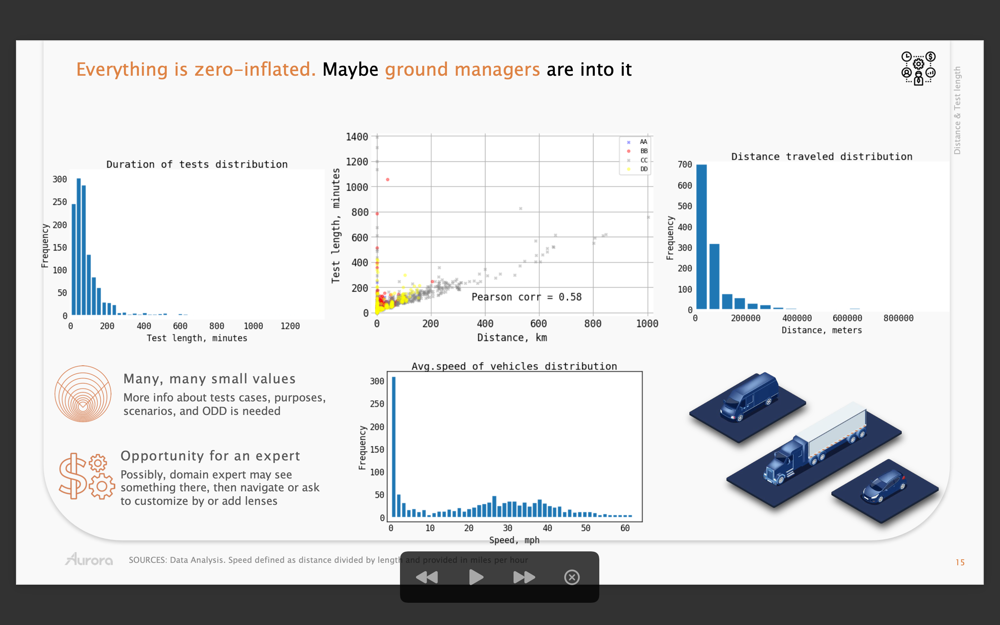

## Project
**CAV company data case**.



## Task description
Research the data and answer additional questions

Current **raw report available** [[html]](https://htmlpreview.github.io/?https://github.com/Witold1/CAV_data_case/blob/master/reports/Report_final.html) | [[ipynb]](https://nbviewer.org/github/Witold1/CAV_data_case/blob/master/notebooks/Report_final.ipynb)

Current **presentation available** [[pdf]](https://drive.google.com/file/d/1KPciOPsQ1hpW3ij8KY1EatRXYsiUZNRv/view?usp=sharing)

## Selected charts

| Charts                                                                                      	|
|--------------------------------------------------------------------------------------	|
|  	|
|  	|
|  	|

## Structure of repository
```
Project structure:
+--data                       <- folder for data
¦  L--raw                     <- ... raw data
¦  L--interim                 <- ... auxiliary, generated, temporary or pre-processed data
¦  L--processed               <- ... final ready-to-analyze data
¦  L--external                <- ... additional datasets
¦  
+--notebooks                  <- folder for .ipynb files
¦  L--.ipynb 1    <- ...
¦
+--src                        <- folder for .py scripts
¦  L--.py 1    <- ... file 1
¦  L--.py 1    <- ... file 3
¦  L--.py 2    <- ... file 2
¦
+--figures                    <- folder for charts and images to reports
¦  L--internal               
¦  L--external               
¦
+--reports                    <- folder for reports .pptx, .html, .ipynb
¦
+--README.md
```

## Links
> Placeholder

## License and legals
Ask before use.
